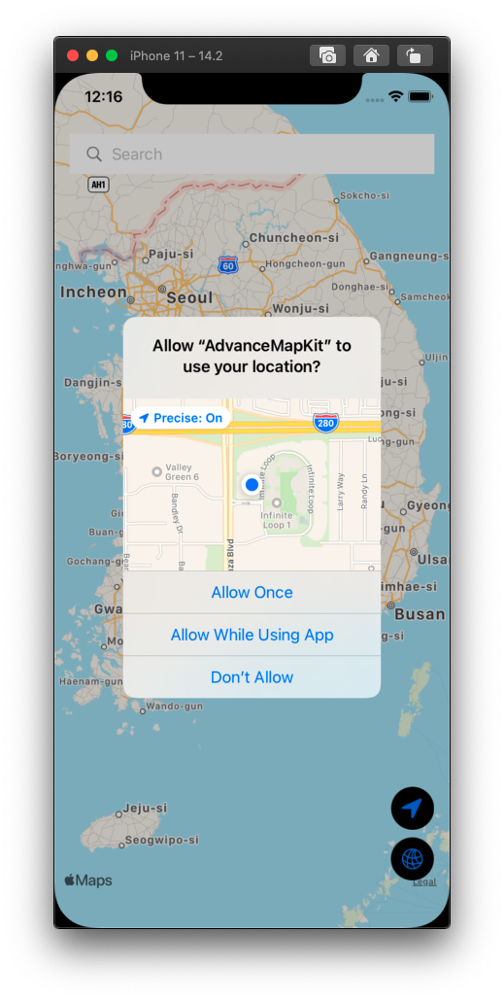
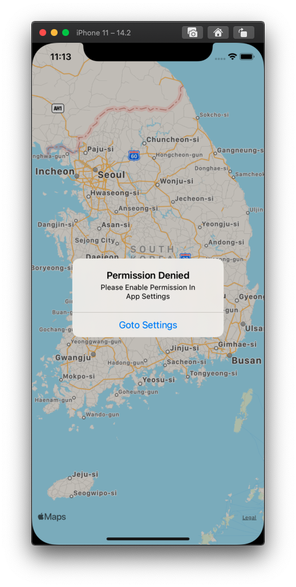
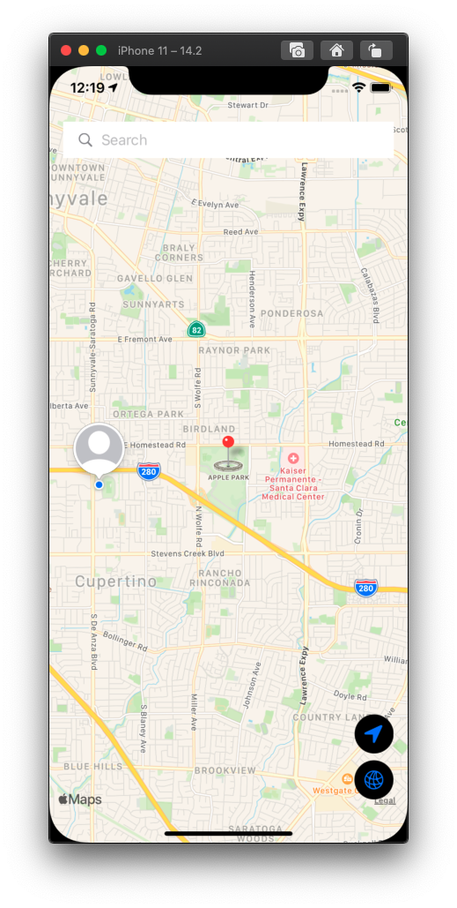
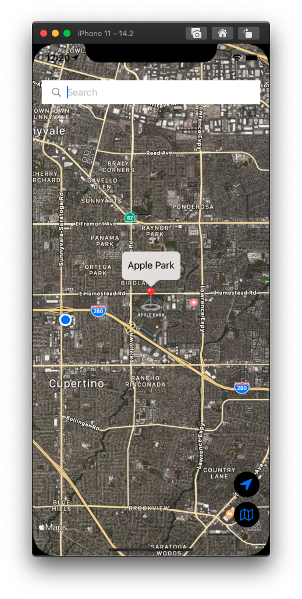
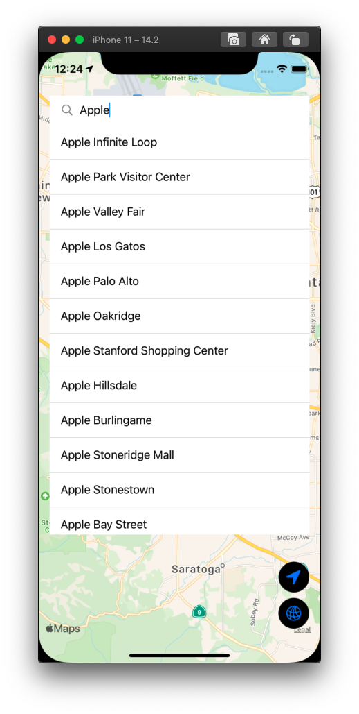
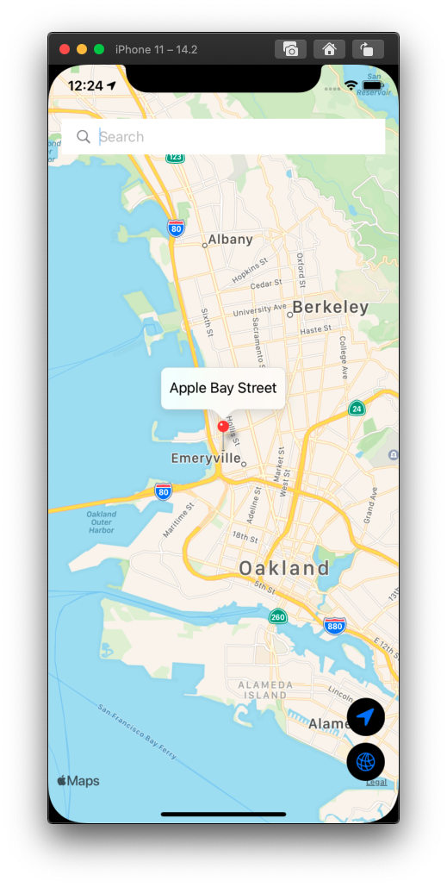

# SwiftUI - Advance Map Kit

with: MapKit, Core Location, MVVM, Custom Search Bar, SwiftUI

### 동작 화면






### 구현 기능

1. 위치 권한 설정
2. 현재 위치 표시
3. 장소 검색 
4. 검색 결과 Pin으로 표시
5. location 버튼: 현재 위치로 이동
6. Map Type 변경: standard / hybrid
7. Custom Pin 


### 새로운 키워드

`@StateObject`

` @EnvironmentObject`

`UIViewRepresentable`

```swift
func environmentObject<T>(_ object: T) -> some View where T : ObservableObject
```

`ObservableObject`

`Identifiable`

`@Published`

```swift
func onChange<V>(of value: V, perform action: @escaping (V) -> Void) -> some View where V : Equatable
```

`UUID().uuidString`

`CoreLocation`

`MapKit`

`CLPlacemark`

`MKCoordinateRegion`

`MKMapView().setVisibleMapRect`

```swift
func setVisibleMapRect(_ mapRect: MKMapRect, animated animate: Bool)
```

### 궁금한 것

1. 프로퍼티 앞에 $를 붙이는 경우와 그렇지 않은 경우
2. SwiftUI + MVVM 동작 방식

### 블로그

작성 예정입니다.


### 참고

[SwiftUI 2.0 Advance Map Kit Tutorials - Core Location - MVVM - Custom Search Bar - SwiftUI Tutorials ㄷㅗㅇ](https://youtu.be/7HYIe5uHo78)

