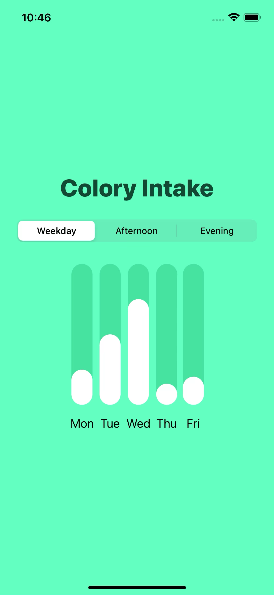
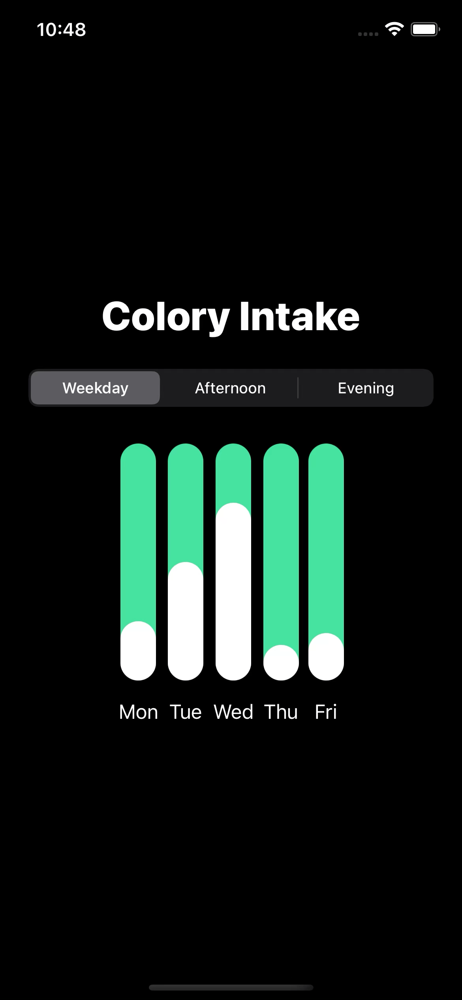

# SwiftUI - Simple Bar Graph

### 동작 화면

 

### 새로운 키워드

**`@State`**

`var body: some View {}`

**`Capsule`**

**SwiftUI의 라이프사이클**

### 블로그

작성 예정입니다.

### 참고

[SwiftUI: Animated Bar Charts and Picker Segmented Style Binding](https://youtu.be/5lSJzzI2fj8)

